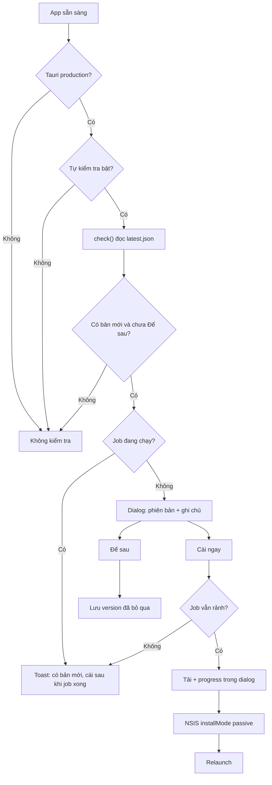

# In-app update (Tauri 2 + GitHub Releases)

App **chưa có** updater. Release hiện tại chỉ đăng NSIS `.exe` lên GitHub. Plan này thêm kiểm tra / tải / cài **trong app**, dùng plugin chính thức, không tự viết HTTP hay server riêng.

Endpoint:

`https://github.com/nguyentung164/CIV7-Localization-Tool/releases/latest/download/latest.json`

Đây **không phải hot-patch JS**. Mỗi lần update là cài lại installer NSIS (app + sidecar Python `localization-engine` + `_internal`). Đúng với kiến trúc hiện tại.

## Luồng người dùng

Bạn đã chọn: **tự kiểm tra khi mở app + dialog xác nhận**. Không bao giờ cài khi job CIV7 hoặc Legend đang chạy.



**Để sau**: chỉ ẩn auto-prompt cho **đúng version đó**. Bản mới hơn vẫn hiện lại. Nút thủ công ở Giới thiệu vẫn kiểm tra được.

## Việc bạn phải làm thủ công (trước khi CI ra bản updater đầu tiên)

1. Tạo cặp khóa (một lần, trên máy bạn):

```powershell
npm run tauri signer generate -- -w $env:USERPROFILE\.tauri\localization-tool.key
```

2. Copy **public key** vào config (commit được).
3. Đưa **private key** + password vào GitHub Secrets:
   - `TAURI_SIGNING_PRIVATE_KEY` (nội dung file key, không commit)
   - `TAURI_SIGNING_PRIVATE_KEY_PASSWORD` (để trống nếu không đặt password)
4. **Không** dùng Authenticode Windows trong phạm vi này. Updater tin chữ ký minisign của Tauri. SmartScreen vẫn có thể cảnh báo installer chưa ký EV — làm sau nếu cần.

**Lưu ý quan trọng:** user đang dùng **v1.1.0 không tự OTA lên bản đầu tiên có updater**. Họ vẫn tải `.exe` một lần. Từ bản có updater trở đi (ví dụ v1.2.0 → v1.2.1) mới cập nhật trong app.

## 1. Config native

**[src-tauri/tauri.conf.json](src-tauri/tauri.conf.json)** — pubkey + endpoint (cần lúc runtime):

```json
"plugins": {
  "updater": {
    "pubkey": "<nội dung public key>",
    "endpoints": [
      "https://github.com/nguyentung164/CIV7-Localization-Tool/releases/latest/download/latest.json"
    ],
    "windows": { "installMode": "passive" }
  }
}
```

`passive`: user đã xác nhận trong app, NSIS hiện progress, không wizard.

**[src-tauri/tauri.release.conf.json](src-tauri/tauri.release.conf.json)** — thêm `"bundle.createUpdaterArtifacts": true` (overlay CI + `npm run build:release`). Không để flag này ở conf dev để `tauri dev` không đòi private key.

**[src-tauri/Cargo.toml](src-tauri/Cargo.toml)**

- `tauri-plugin-updater = "2"`
- `tauri-plugin-process = "2"` (relaunch)

**[src-tauri/src/lib.rs](src-tauri/src/lib.rs)** — đăng ký cùng các plugin khác:

- `.plugin(tauri_plugin_updater::Builder::new().build())`
- `.plugin(tauri_plugin_process::init())`

**[src-tauri/capabilities/default.json](src-tauri/capabilities/default.json)**

- `updater:default` (hoặc `updater:allow-check`, `updater:allow-download`, `updater:allow-install`)
- `core:app:allow-version` nếu UI đọc version runtime (ưu tiên `getVersion()` từ `@tauri-apps/api/app` thay vì chỉ `APP_VERSION` hardcode)
- `process:allow-relaunch`

CSP **không cần** thêm GitHub: plugin fetch bằng Rust, không qua webview.

## 2. CI và build local

**[.github/workflows/release.yml](.github/workflows/release.yml)** — đã có `updaterJsonPreferNsis: true`. Bổ sung env khi gọi `tauri-action`:

- `TAURI_SIGNING_PRIVATE_KEY`
- `TAURI_SIGNING_PRIVATE_KEY_PASSWORD`

Không đổi `GITHUB_TOKEN` / `contents: write`. Repo public nên `latest.json` tải không cần token.

**[scripts/build_all.ps1](scripts/build_all.ps1)** — trước `tauri build`: nếu thiếu `TAURI_SIGNING_PRIVATE_KEY` thì fail với hướng dẫn rõ (vì overlay release sẽ tạo artifact updater). Sửa luôn đường dẫn installer đang hardcode `..._1.1.0_x64-setup.exe` thành version đọc từ `package.json` / `tauri.conf.json` để khỏi gãy mỗi lần bump.

## 3. Frontend

Packages:

- `@tauri-apps/plugin-updater`
- `@tauri-apps/plugin-process`

**Logic thuần (test được, không gọi Tauri):** [src/lib/app-updater.ts](src/lib/app-updater.ts)

- `shouldAutoCheck({ isTauri, isDev, autoCheckEnabled })`
- `shouldPrompt({ currentVersion, latestVersion, dismissedVersion })`
- persist localStorage: `app-updater-auto-check` (mặc định bật), `app-updater-dismissed-version`
- **Không** nhét vào `AppConfig` Rust — tránh đụng schema/orchestrator

**Hook:** [src/hooks/use-app-updater.ts](src/hooks/use-app-updater.ts)

- Skip `!isTauriRuntime()` và `import.meta.env.DEV`
- Auto-check sau khi app load xong (`loading === false`), không chặn splash
- `check()` → nếu có update và chưa dismiss → mở dialog; nếu đang `running` → toast, giữ `pendingUpdate`
- `downloadAndInstall(event => progress)`; Windows NSIS thường tự restart; vẫn `relaunch()` sau install theo docs (no-op nếu process đã bị installer tắt)
- Guard lần hai ngay trước install

**UI**

- Dialog global trong [src/App.tsx](src/App.tsx) (AlertDialog có sẵn): version hiện tại vs mới, body release, progress tải, **Cài ngay** / **Để sau**; disable Cài ngay khi `civRunning || legendRunning`
- [src/components/about-page.tsx](src/components/about-page.tsx): version runtime + **Kiểm tra cập nhật** + trạng thái (đang kiểm tra / đã mới nhất / có bản x.y.z)
- [src/components/settings-page.tsx](src/components/settings-page.tsx): tab **Cập nhật** — switch tự kiểm tra khi mở app + cùng nút kiểm tra
- FAQ trong [src/content/help-sections.ts](src/content/help-sections.ts)

## 4. Docs

- [RELEASE.md](RELEASE.md): secrets, `latest.json` + `.sig` trên Releases, “bản đầu tiên có updater phải cài tay”
- [README.md](README.md): một dòng cập nhật trong app

## 5. Test / xác minh

- Vitest: shouldPrompt, dismiss, auto-check flags, format progress
- Hook test mock `check` / `downloadAndInstall` (pattern [src/hooks/use-legend-translation.test.ts](src/hooks/use-legend-translation.test.ts))
- Manual: `tauri dev` không auto-check; CI release có `latest.json`; máy cài bản updater-enabled, tag bản cao hơn, mở app thấy dialog, job đang chạy thì không cài

## Ngoài phạm vi

- Ký Authenticode / timestamp Comodo
- Server update riêng, delta patch, cập nhật chỉ frontend
- Auto-cài im lặng
- Sửa engine Python cho updater
